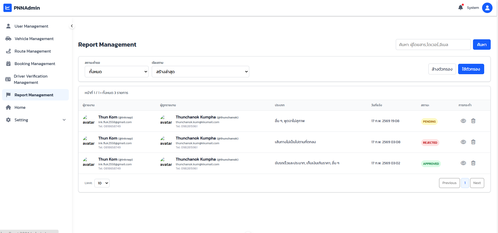
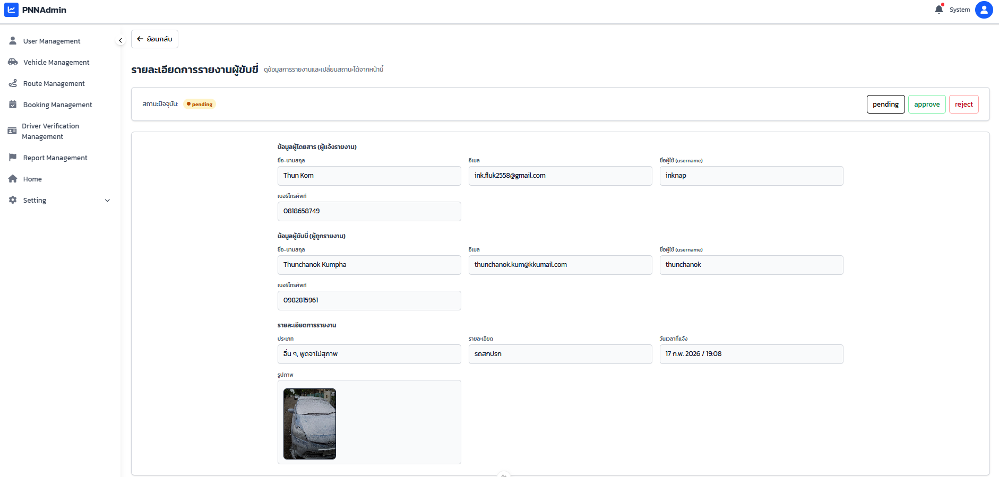
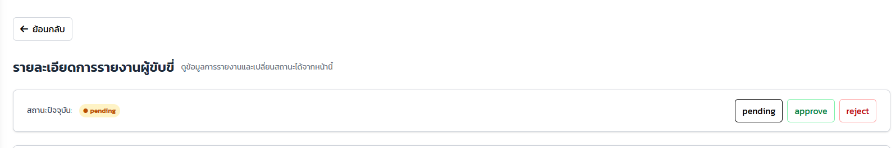

# User Manual

## 1. เมนูการจัดการรายงานคนขับของผู้โดยสาร (กรณีเป็นผู้ดูแลระบบ)

ผู้ดูแลระบบสามารถเข้าถึงเมนูการจัดการรถยนต์เพื่อดูรายการ **รายงานคนขับทั้งหมด** ที่ถูกเพิ่มเข้ามาในระบบ โดยในแต่ละแถวของตารางจะแสดงข้อมูลพื้นฐาน ได้แก่  
- ชื่อผู้รายงาน  
- ชื่อผู้ถูกรายงาน  
- ประเภทการรายงาน  
- วันที่แจ้งรายงาน  
- สถานะการดำเนินการ  

ผู้ดูแลระบบสามารถ **กรองข้อมูลตามสถานะการรายงาน** ได้ตามต้องการ นอกจากนี้ยังมีปุ่มสำหรับ  
- ดูรายละเอียดของรายงาน  
- ลบข้อมูลการรายงานของผู้โดยสารออกจากระบบได้โดยตรง  

---

## 2. หน้ารายละเอียดการรายงานคนขับ

เมื่อผู้ดูแลระบบกดปุ่ม **“รายละเอียด”** หรือปุ่มไอคอนรูปดวงตา ระบบจะแสดงหน้าสำหรับดูรายละเอียดของรายงานที่เลือก โดยแสดงข้อมูลดังต่อไปนี้

### 2.1 ข้อมูลผู้แจ้งรายงานและข้อมูลผู้ถูกรายงาน
ระบบจะแสดงข้อมูลของผู้แจ้งรายงานและผู้ถูกรายงานทั้งหมด เพื่อให้ผู้ดูแลระบบใช้ประกอบการพิจารณา
แสดงข้อมูลของผู้ถูกรายงาน ได้แก่  
- ชื่อและนามสกุล  
- อีเมล  
- ชื่อผู้ใช้  
- หมายเลขโทรศัพท์  

### 2.3 รายละเอียดการรายงาน
ในส่วนนี้จะแสดงข้อมูลที่ผู้ใช้กรอกผ่านฟอร์มรายงาน ได้แก่  
- ประเภทของการรายงาน เช่น พูดจาไม่สุภาพ ขับรถเร็วและประมาท หรือเก็บเงินเกินราคา  
- รายละเอียดเพิ่มเติมจากผู้รายงาน  
- รูปภาพประกอบการรายงาน  
- วันและเวลาที่แจ้งรายงาน  

---

## 3. การดำเนินการของผู้ดูแลระบบ

หลังจากผู้ดูแลระบบตรวจสอบข้อมูลการรายงาน หากพบว่าข้อมูลไม่ถูกต้องหรือไม่เรียบร้อย  
ผู้ดูแลระบบสามารถ **ส่งการแจ้งเตือนไปยังผู้ใช้** เพื่อขอข้อมูลเพิ่มเติมหรือแจ้งผลการตรวจสอบได้

