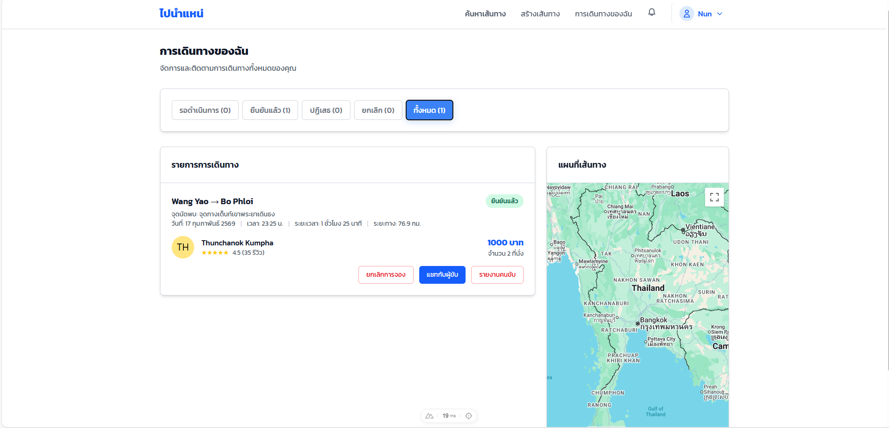
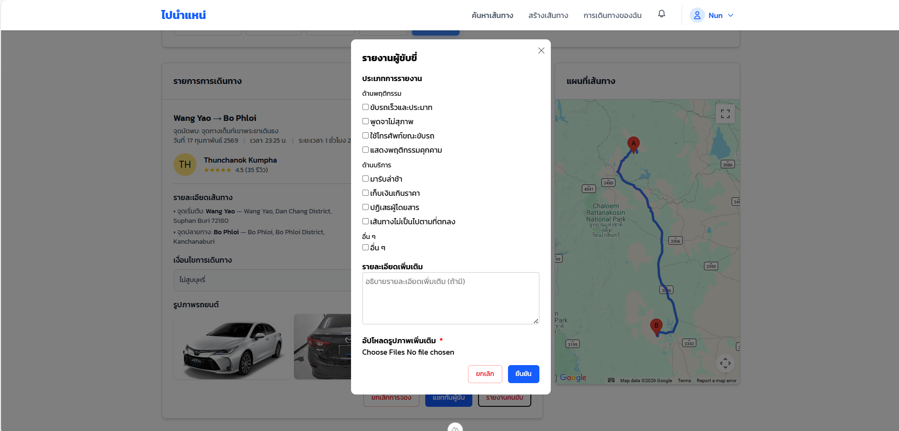
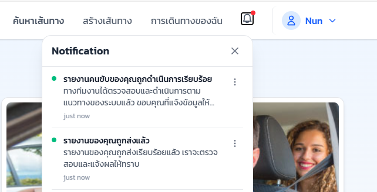
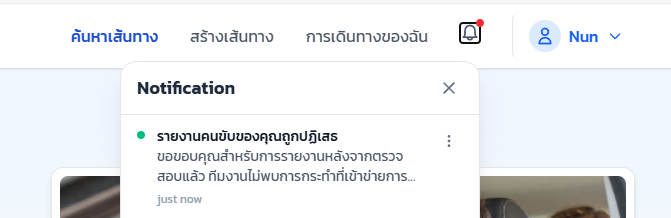

# User Manual

## 1. เมนูการจัดการรายงานคนขับของผู้โดยสาร (กรณีเป็นผู้ดูแลระบบ)

ผู้ดูแลระบบสามารถเข้าถึงเมนูการจัดการรถยนต์เพื่อดูรายการ **รายงานคนขับทั้งหมด** ที่ถูกเพิ่มเข้ามาในระบบ โดยในแต่ละแถวของตารางจะแสดงข้อมูลพื้นฐาน ได้แก่  
- ชื่อผู้รายงาน  
- ชื่อผู้ถูกรายงาน  
- ประเภทการรายงาน  
- วันที่แจ้งรายงาน  
- สถานะการดำเนินการ  

ผู้ดูแลระบบสามารถ **กรองข้อมูลตามสถานะการรายงาน** ได้ตามต้องการ นอกจากนี้ยังมีปุ่มสำหรับ  
- ดูรายละเอียดของรายงาน  
- ลบข้อมูลการรายงานของผู้โดยสารออกจากระบบได้โดยตรง  

---

## 2. หน้ารายละเอียดการรายงานคนขับ

เมื่อผู้ดูแลระบบกดปุ่ม **“รายละเอียด”** หรือปุ่มไอคอนรูปดวงตา ระบบจะแสดงหน้าสำหรับดูรายละเอียดของรายงานที่เลือก โดยแสดงข้อมูลดังต่อไปนี้

### 2.1 ข้อมูลผู้แจ้งรายงานและข้อมูลผู้ถูกรายงาน
ระบบจะแสดงข้อมูลของผู้แจ้งรายงานและผู้ถูกรายงานทั้งหมด เพื่อให้ผู้ดูแลระบบใช้ประกอบการพิจารณา
แสดงข้อมูลของผู้ถูกรายงาน ได้แก่  
- ชื่อและนามสกุล  
- อีเมล  
- ชื่อผู้ใช้  
- หมายเลขโทรศัพท์  

### 2.3 รายละเอียดการรายงาน
ในส่วนนี้จะแสดงข้อมูลที่ผู้ใช้กรอกผ่านฟอร์มรายงาน ได้แก่  
- ประเภทของการรายงาน เช่น พูดจาไม่สุภาพ ขับรถเร็วและประมาท หรือเก็บเงินเกินราคา  
- รายละเอียดเพิ่มเติมจากผู้รายงาน  
- รูปภาพประกอบการรายงาน  
- วันและเวลาที่แจ้งรายงาน  

---

## 3. การดำเนินการของผู้ดูแลระบบ

หลังจากผู้ดูแลระบบตรวจสอบข้อมูลการรายงาน หากพบว่าข้อมูลไม่ถูกต้องหรือไม่เรียบร้อย  
ผู้ดูแลระบบสามารถ **ส่งการแจ้งเตือนไปยังผู้ใช้** เพื่อขอข้อมูลเพิ่มเติมหรือแจ้งผลการตรวจสอบได้

## 2. เมนูการเดินทางของฉัน (เมื่อต้องการรายงานผู้ขับขี่)

ผู้โดยสารสามารถดูรายการเดินทางที่ได้จองไว้ทั้งหมดได้ในเมนู **“การเดินทางของฉัน”**  
ระบบจะแสดงข้อมูลเส้นทางที่จอง รวมถึงรายละเอียดผู้ขับขี่ วันที่ เวลา ราคา และแผนที่เส้นทาง  
เมื่อได้รับการยืนยันจากผู้ขับขี่แล้ว ผู้โดยสารจะสามารถกดปุ่ม **รายงานผู้ขับขี่** ได้

---

### 2.1 หน้าฟอร์มรายงานผู้ขับขี่

เมื่อผู้โดยสารกดปุ่ม **รายงานผู้ขับขี่** ระบบจะแสดงหน้าฟอร์มสำหรับรายงานผู้ขับขี่  
โดยผู้โดยสารสามารถเลือกประเภทการรายงานได้ ดังนี้

- ด้านพฤติกรรม เช่น ขับรถเร็วและประมาท พูดจาไม่สุภาพ  
- ด้านบริการ เช่น มารับล่าช้า เก็บเงินเกินราคา  
- อื่น ๆ  

นอกจากนี้ ผู้โดยสารสามารถกรอกรายละเอียดเพิ่มเติม และอัปโหลดรูปภาพประกอบเพื่อใช้เป็นหลักฐานให้แก่ผู้ดูแลระบบ  
เมื่อกรอกข้อมูลครบถ้วนแล้ว ให้กดปุ่ม **ยืนยัน** เพื่อส่งข้อมูลการรายงาน

---

### 2.2 การแจ้งเตือนหลังส่งฟอร์มรายงาน

เมื่อผู้แจ้งรายงานกดปุ่ม **ยืนยัน** ระบบจะแสดงข้อความแจ้งเตือนที่ **ไอคอนรูปกระดิ่ง**  

- หากผู้ดูแลระบบอัปเดตสถานะการรายงานเป็น **Approve**  
  ระบบจะแสดงข้อความแจ้งเตือนว่า  
  **“รายงานคนขับของคุณถูกดำเนินการเรียบร้อย”**

- หากผู้ดูแลระบบอัปเดตสถานะการรายงานเป็น **Reject**  
  ระบบจะแสดงข้อความแจ้งเตือนว่า  
  **“รายงานคนขับของคุณถูกปฏิเสธ”**

